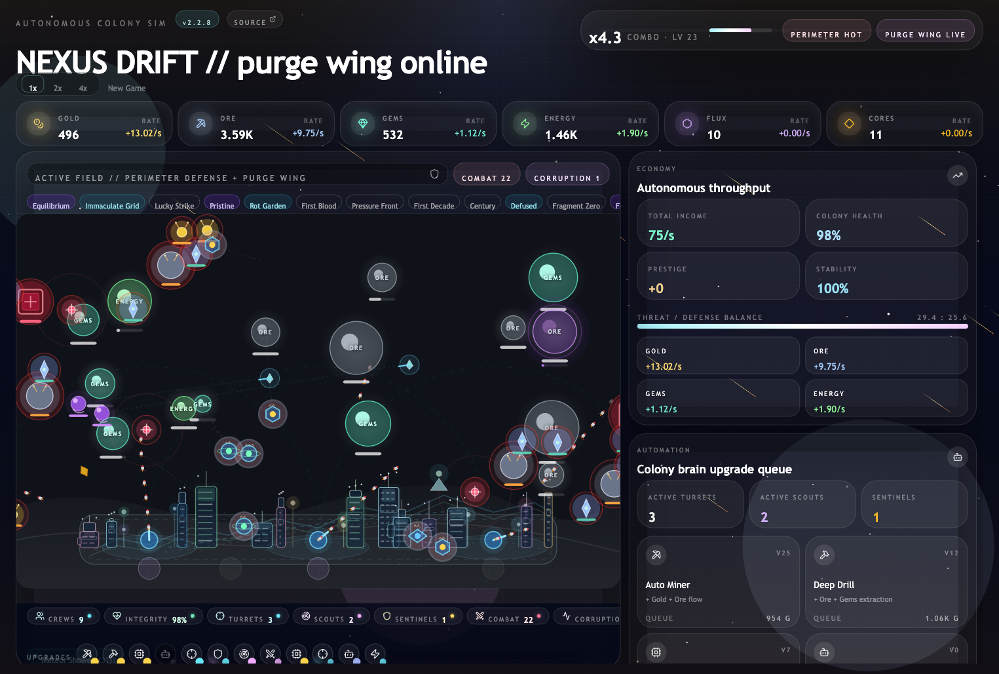

# Nexus Drift

Nexus Drift is an autonomous sci-fi colony sim wallpaper built with React, TypeScript, and Vite. Workers mine on their own, raiders push the perimeter, turrets hold the line, and scout craft hunt corruption before it rots the economy.

**Current release:** `2.4.3` &nbsp;|&nbsp; **Stack:** React · TypeScript · Vite · Tailwind



---

## Features

### Simulation & Economy

- Fully browser-run simulation with no network gameplay dependency
- Deterministic seeded RNG in the simulation layer for reproducible runs
- Each worker kind (miner / runner / drone) supports up to 3 simultaneous units, but extra crews are now a true late-game unlock: the relevant track still has to reach its slot levels, the colony must also hit sector levels 12 and 24, and those key unlock upgrades now charge both Flux and Cores
- Workers now commit harder to partially mined resources: distant threats have less proactive pull, current nodes get a stronger finish bias, fleeing workers can opportunistically retarget to safe nodes ahead, and recently worked health bars leave a fading mined-progress cue without regenerating node HP
- Flux and Cores feed multi-resource upgrades (Foundry, Data Archive, Sentinel Mechs)
- Seeded random events (12 event types) temporarily bend yields, speed, corruption pressure, and surprise spawns; the 3 one-shot events now surface as short-lived inspectable cards instead of disappearing immediately, then fade away without a visible countdown

### Combat & Enemies

- Mid-game enemy roster: rushers, brutes, sappers, blights, leeches, phantoms, and zappers — each kind now maps to an AI archetype (direct line, flanker, ambusher, ghost, skirmisher) with emergent squad-level flanking when multiple hostiles share a target
- Zappers are a late-game (tier 7+) ranged threat — holds at firing distance, fires slow energy bolts that disable a worker or turret for ~7 seconds
- Enemies apply soft repulsion when crowding the same target — they orbit at staggered angles rather than piling on top of each other
- Turrets fire homing missiles that travel visibly and steer toward their original target; launched missiles now have a small terminal grace window, but still never rehome or splash if that target dies first. The Focused Beam upgrade (tier 4+) adds instant-hit fire for close-range targets
- 54 achievements across 4 rarity tiers (common / uncommon / rare / legendary) and 6 categories, including click-driven secrets for event inspection, anomaly witnessing, corpse/projectile interactions, UI opens, and a timed speed-sequence

### HUD & UI

- Glanceable upgrade rail and field stats strip — on mobile the rail stays in the field footer; on desktop it floats in the top-right chrome band so the footer can prioritize events and live field stats without shrinking the field
- The desktop top-right upgrade rail now sits a touch closer to the sector card and uses a thinner horizontal scrollbar so it doesn't crowd the resource pills beneath it
- Active events live in a persistent footer strip that's always visible — timed events render as inspectable pills with countdowns, one-shot events now use the same compact chip size but fade away without counters, crowded rows stay a single horizontal scroller instead of wrapping labels into stacked chips, inspected cards simply dim their existing marker dot, and the canvas size never jumps as events come and go
- Each active event drives a distinct ambient backdrop effect (meteor streaks, xeno spore fog, dust storm haze, solar flare pulses, and more) plus a tone-coded HUD chip; coarse-pointer desktop layouts such as iPadOS landscape fall back to a cheaper static variant so the visual identity stays intact without the Safari lag hit
- Activity log: up to 40 structured entries with per-category icons, relative-age timestamps, and a filter tab bar
- Entities fade in and out instead of popping: nodes, enemies, and agents all animate on spawn and death
- Mature colonies can attract a tiny tourist drone; repeated clicks now just squish it, count per pass, and feed multiple hidden achievements without flashing an oversized white click outline
- Late-game interaction props live directly in the field: a broken recoverable lost drone, a 3-event anomaly artifact, clickable zapper bolts, in-flight missiles, and corpse clicks during enemy death-fade windows
- The in-field achievement ribbon now shows newly unlocked badges first on the left, pushing older ones rightward so fresh unlocks are immediately visible, and clicking a badge jumps the archive modal straight to that achievement with a scroll/focus pulse that fades out cleanly

### Controls & Persistence

- Speed presets: `1x`, `2x`, `4x` stay in the top chrome on every breakpoint; hidden admin speed panel behind `Space` × 5
- The shell now polls `/version` roughly every 5 minutes (and when the tab regains focus), extracts a flat semver from the response, and shows a live-update banner with `Refresh`, `Close`, and session-only `Don't Show Again` actions when a newer build is live; the hidden admin panel can also force that banner open for testing
- Long runs autosave every 30 seconds, restore on reload, and pause cleanly while the tab is hidden
- Save files carry a schema version for explicit forward-compatible migration
- In-game release history: click the version badge next to `Autonomous Colony Sim`; the version badge itself now also participates in a hidden secret achievement
- GitLab source link sits in the top project chrome beside the version badge
- Favicon stack now includes SVG, PNG, ICO, Apple touch icon, and web manifest fallbacks for broader browser coverage

### Layout

- Responsive: two-column desktop layout activates at 1024px (`lg`), so 11-inch iPads in landscape get the full side-by-side view
- Desktop iPad layouts use dynamic viewport sizing (`100dvh`) plus safe-area bottom padding so the field card and its overlay footer stay inside the visible viewport when Safari's URL bar is present, and the field reserves an inset above the overlay footer on every breakpoint so the bottom HUD stays readable without covering the home district
- On coarse-pointer `lg` desktops, the heaviest ambient background / event animation paths and SVG text blur are intentionally reduced so scrolling stays smooth on iPadOS Safari without flattening the overall look
- On `lg` two-column screens, the upgrade rail is absolutely overlaid in the top-right chrome band above the resource bar instead of taking up vertical layout space

---

## Development

```bash
npm ci
npm run dev
```

```bash
npm run typecheck   # type checking
npm test            # unit tests (89 tests across src/game/__tests__/ and src/lib/)
npm run lint
npm run build
npm run preview
npm run format:check
```

---

## Architecture

| Path                                      | Role                                                                                                                                                                                                                                                 |
| ----------------------------------------- | ---------------------------------------------------------------------------------------------------------------------------------------------------------------------------------------------------------------------------------------------------- |
| `src/App.tsx`                             | Top-level shell: save bootstrap, speed presets, interaction-achievement triggers, admin panel, event test triggers, release-history modal                                                                                                            |
| `src/changelog.ts`                        | In-game release notes sourced from repo milestones                                                                                                                                                                                                   |
| `index.html`                              | App metadata, multi-format favicon links, web manifest link, and Open Graph / Twitter embed tags                                                                                                                                                     |
| `src/hooks/useLowFxMode.ts`               | Detects coarse-pointer desktop layouts (notably iPadOS landscape) so presentation layers can use cheaper FX variants without touching sim logic                                                                                                      |
| `src/hooks/useVersionCheck.ts`            | Polls `/version`, compares the live semver against `CURRENT_VERSION`, and drives the update-available banner in the app shell                                                                                                                        |
| `src/hooks/useGameLoop.ts`                | `requestAnimationFrame` loop, pause-on-hidden, autosave cadence, live field snapshots, throttled UI snapshot                                                                                                                                         |
| `src/game/advanceGame.ts`                 | Thin orchestrator that runs the simulation step order                                                                                                                                                                                                |
| `src/game/achievements.ts`                | Achievement definitions plus the UI/field interaction helpers for tourist, event cards, projectiles, corpses, modal opens, and lost-drone recovery                                                                                                   |
| `src/game/persistence.ts`                 | localStorage save/load bootstrap and migration entry point                                                                                                                                                                                           |
| `src/game/balance.ts`                     | Central tuning constants                                                                                                                                                                                                                             |
| `src/game/events/eventDefs.ts`            | Seeded mechanical event definitions, HUD linger metadata, and activation helpers                                                                                                                                                                     |
| `src/game/rng.ts`                         | Seeded Mulberry32 PRNG used by all simulation paths                                                                                                                                                                                                  |
| `src/game/targeting.ts`                   | Shared targeting helpers                                                                                                                                                                                                                             |
| `src/game/subsystems/`                    | Focused simulation modules: economy, spawns, movement, combat, scouts, sentinels, turrets, corruption, mining, autobuy, projectiles, events                                                                                                          |
| `src/components/FieldSvg.tsx`             | Battlefield SVG rendering; static district geometry memoized by seed/turret layout, with the expensive label blur disabled in low-FX mode and interactive targets for the tourist, lost drone, anomaly artifact, projectiles, and death-fade corpses |
| `src/components/EventBackdrop.tsx`        | Full-screen ambient effect layer keyed off active event ids (purely presentational, respects `prefers-reduced-motion` and coarse-pointer low-FX mode)                                                                                                |
| `src/components/EventChip.tsx`            | Active-event HUD pill/card with hover/focus tooltip and click-to-inspect behavior                                                                                                                                                                    |
| `src/components/UpgradeIndicatorRail.tsx` | Horizontal rail of upgrade dots — glow on level, pulse when affordable, tooltip on hover/focus                                                                                                                                                       |
| `src/components/FieldStatsStrip.tsx`      | Compact pill row of live field stats with tone colours and detail tooltips                                                                                                                                                                           |
| `src/components/ActivityLog.tsx`          | Structured log panel with category icons, relative timestamps, and filter tabs                                                                                                                                                                       |
| `src/components/AchievementsModal.tsx`    | Achievements modal with category tabs, rarity colouring, hidden masking, progress bar, and target-aware scroll/focus navigation from the ribbon                                                                                                      |
| `src/components/Sidebar.tsx`              | Economy, automation, and threat panels                                                                                                                                                                                                               |
| `src/components/Background.tsx`           | Animated starfield and atmosphere layers; swaps to a static cheaper variant on coarse-pointer desktop layouts                                                                                                                                        |
| `src/components/HudPrimitives.tsx`        | Shared HUD widgets (StatusBadge, ResourcePill, StatTile, UpgradeTile)                                                                                                                                                                                |
| `src/components/Tooltip.tsx`              | Shared `TooltipPanel` primitive; `useTooltip` hook in `src/hooks/useTooltip.ts`                                                                                                                                                                      |
| `src/lib/manualOverride.ts`               | Pure helper for the hidden `1x -> 4x -> 1x` speed-sequence achievement timing                                                                                                                                                                        |
| `src/lib/versionCheck.ts`                 | Flat-version parsing, semver comparison, and `/version` fetch helper for the live-update banner                                                                                                                                                      |
| `src/components/ui/`                      | Local card and progress bar primitives                                                                                                                                                                                                               |
| `reference/`                              | Preserved single-file reference artifact                                                                                                                                                                                                             |

---

## Build & Delivery

```bash
# Production build
npm run build

# Docker
docker build -t nexus-drift .
docker run --rm -p 8080:80 nexus-drift

# Compose
docker compose up --build
```

The production image serves the static Vite build with Nginx on port `80`.

---

## CI

GitLab CI runs:

- **verify** — `npm ci`, `npm run typecheck`, `npm test`
- **image build** — Kaniko-based build that publishes the container image
- **notifications** — success and failure alerts after the pipeline completes

Container release images are built automatically only for `main` and `dev`: `main`
publishes the commit SHA plus `:latest`, while `dev` publishes the commit SHA plus
`:dev`.

---

## Notes For Contributors

- Keep `package.json` version and `src/changelog.ts` aligned when doing release work.
- If architecture, commands, or player-facing behavior changes, update `README.md` and `handoff.md` in the same pass.
- Follow-up UI/docs tweaks belong to the current in-flight release unless the user says otherwise.
- Local `.claude/` files are tooling noise; repo docs, git status summaries, and linting should treat the whole directory as ignored.
- Compare against `reference/idle_wallpaper_game.reference.jsx` when you need the original intended feel.
- Performance rule of thumb: keep the field live, but prefer throttled or memoized snapshots for non-field chrome (resource bars, sector card, sidebar, logs) so scrolling and hover do not compete with the 30 Hz simulation loop. On coarse-pointer desktop layouts, preserve the visual direction but route expensive ambient motion and SVG filters through `useLowFxMode`.
